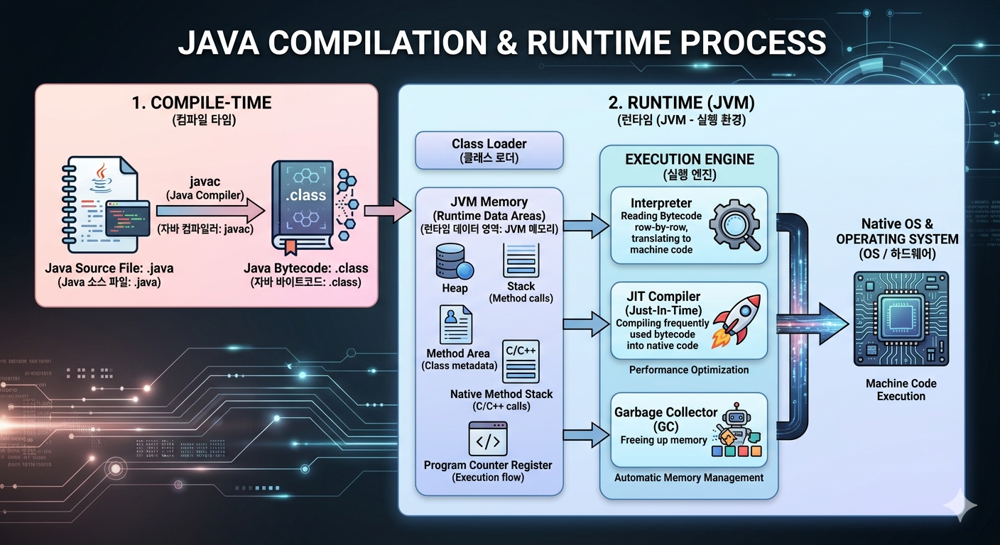

# Chapter 01 - 자바 소개와 개발 환경 준비

[Java Programming 학습 로드맵](../../canvas/Java-Programming-학습-로드맵.canvas)

## 🎯 학습 목표

- 자바 언어의 특징과 장점을 설명할 수 있습니다.
- **JDK**, **JRE**, **JVM**의 역할 차이를 구분할 수 있습니다.
- 자바 개발 환경을 구성하고 첫 프로그램을 실행할 수 있습니다.

---

## 📚 학습 내용

### 1. Java 언어의 이해

#### 1-1. Java 언어의 탄생 배경과 철학

- **Java의 탄생 배경:**
  - Java는 1995년에 Sun Microsystems(현재 Oracle)에서 발표한 언어입니다.
  - 당시에는 **운영체제**마다 프로그램을 따로 만들어야 해서 개발 비용이 컸습니다. 따라서 한 번 작성하면 어디서든 실행할 수 있게 만들어졌습니다.

- **Java의 철학:**
  - **이식성**: **운영체제**가 달라도 동작해야 합니다.
  - **안정성**: **메모리** 오류를 줄이고, 예외 처리로 프로그램이 덜 깨지게 합니다.
  - **객체지향**: 코드를 재사용하기 쉽고 유지보수가 쉬운 구조를 지향합니다.
  - **가독성**: 사람이 읽고 이해하기 쉬운 문법을 중요하게 생각합니다.

#### 1-2. Java의 주요 특징

- **객체지향 언어**: 클래스와 객체 중심으로 프로그램을 구성합니다.
- **플랫폼 독립성**: 한 번 작성한 프로그램을 **운영체제**가 달라도 비슷한 방식으로 실행할 수 있습니다.
- **자동 메모리 관리**: 프로그램이 더 이상 사용하지 않는 **메모리**를 자동으로 정리해줍니다.
- **풍부한 표준 라이브러리**: 문자열, 파일, 네트워크 등 기본 기능이 잘 갖춰져 있습니다.
- **큰 생태계**: 학습 자료와 **오픈소스**, 기업 실무 사례가 많아 배우기 좋습니다.

### 2. Java 프로그램의 동작 원리



#### 2-1. 컴파일 타임

- 개발자가 작성한 소스 파일을 `javac`가 컴파일합니다.
  - 소스 파일의 확장자는 `.java`입니다.
- 컴파일 결과로 바이트코드 파일이 생성됩니다.
- 바이트코드 파일의 확장자는 `.class`입니다.

#### 2-2. 런타임

- **JVM**이 바이트코드 파일을 읽어 실행합니다.
- **클래스 로더**가 필요한 클래스를 **메모리**에 올리고, 실행 엔진이 명령을 처리합니다.
  - **인터프리터**, **JIT 컴파일러**, **가비지 컬렉터**가 함께 동작해 실행과 최적화를 담당합니다.
- 실행 중에는 **메모리** 영역을 사용합니다.

### 3. 개발 환경 구축

아래 문서를 참조하여 **JDK**, **JRE**, **JVM**을 갖춘 개발 환경을 구축합니다.

- [윈도우 기반 WSL 자바 개발환경 설치 메뉴얼](../../guides/menual/윈도우-기반-wsl-자바-개발환경-설치-메뉴얼.md)

### 4. 첫 번째 프로그램 작성

#### 4-1. VS Code에서 Java 프로젝트 생성

1. VS Code를 실행합니다.
2. 명령 팔레트(`Ctrl+Shift+P`)에서 `Java: Create Java Project`를 실행합니다.
3. 프로젝트 템플릿은 `No build tools`를 선택해도 학습용으로 충분합니다.
4. 프로젝트를 생성할 폴더를 선택합니다.
5. 프로젝트 이름을 입력하고 생성이 완료되면 `src` 폴더를 확인합니다.

#### 4-2. Hello World 출력하기

1. `src` 폴더에 `Main.java` 파일을 생성 후 밑의 코드를 입력합니다.
```java
// Java 프로그램의 기본 단위인 클래스를 선언합니다.
public class Main {
    // 프로그램이 시작될 때 가장 먼저 실행되는 메서드(진입점)입니다.
    public static void main(String[] args) {
        // 콘솔에 문자열을 출력하고 줄바꿈합니다. (문장 끝 세미콜론 필수)
        System.out.println("Hello World");
    }
}
```
2. VS Code에서 터미널을 열고, `build` 폴더를 생성합니다.
```bash
mkdir build
```
3. `src` 안의 소스 파일을 컴파일하고, 결과 바이트코드를 `build` 폴더에 저장합니다.
```bash
javac -d ./build ./src/Main.java
```
4. 컴파일이 끝나면 `build` 폴더 안의 클래스 파일을 실행합니다.
```bash
java -cp ./build Main
```
5. 터미널에 `Hello World`가 출력되면 성공입니다.

> 앞으로 빠르고 간편한 실행을 위해 소스 파일에서 `main` 메소드 바로 위에 있는 `run` 버튼을 눌러 실행합니다.

### 5. 주석(Comment)의 종류와 작성 규칙

#### 5-1. 주석(Comment) 종류
  - 한 줄 주석: `// 한 줄 설명`
  - 여러 줄 주석: `/* 여러 줄 설명 */`
  - 문서 주석: `/** API 문서용 설명 */`

#### 5-2. 주석 작성 팁
  - "무엇을 했는지"보다 "왜 이렇게 했는지"를 적으면 더 유용합니다.
  - 너무 당연한 코드에 과도한 주석은 오히려 가독성을 떨어뜨립니다.
